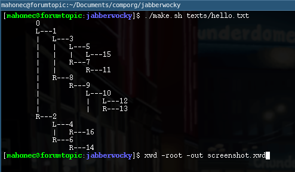
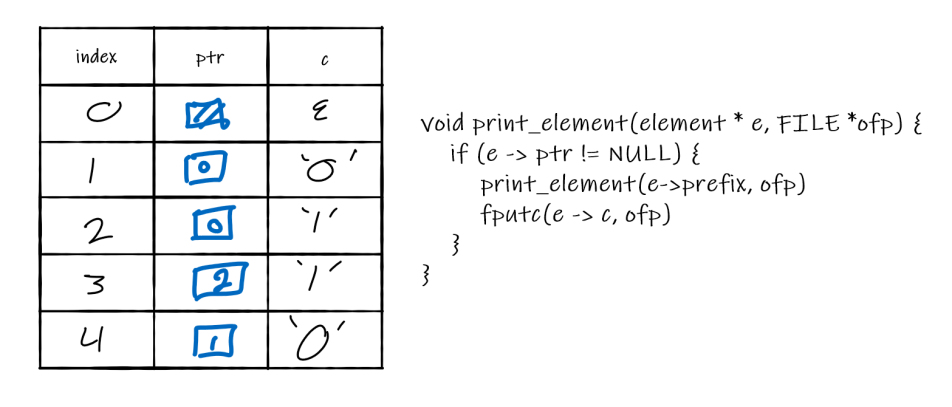

# Jabberwocky
In order to run my code you can simply call `./make.sh <file>`. The files `bit.txt`, `zap.txt`, `kapow.txt` and `out.txt` will be generated in order. The directory texts has some examples.

My implementation for both jabber and wocky used the same fact about our compression table. Every prefix we add to our table was one bit appended to some previously seen prefix. This allows for some cool data structures.

**Jabber:**

TJ had the idea to use a labeled binary tree that we can descend while reading in the prefix. Reading in a zero means descending left and reading a one descends right. Once we reach a leaf node we print it's label in binary and we add a new child node in the direction of the next bit, labeled with tree size + 1.

Using a binary tree in this way means the time complexity for reading in a prefix is proportional to the length of the prefix and not directly related to the size of the tree. 

Ryan and I worked together on implementing Jabber but we wrote our own code.

**Wocky:**

I wrote wocky alone and once again used the "each prefix = some previous prefix + 1 bit" property. Since at each step we read an index (integer) and find the prefix (string) at that index an array of cstrings would be sufficent. `char ** table = malloc(size * sizeof(char*))`. This can be done more memory efficently. Instead of storing cstrings I store a pointer to the previous prefix and 1 character representing the 1 new bit. 

Printing becomes a little more complicated since we can no longer just fprintf a cstring. All it requires is a little bit of recursive decent, unfortunately this can't be written tail recursively. 

**atob and btoa:**

I tried to optimize as much as possible without digging into assembly and calculating running times. They use lots of bit wise opperators. 
